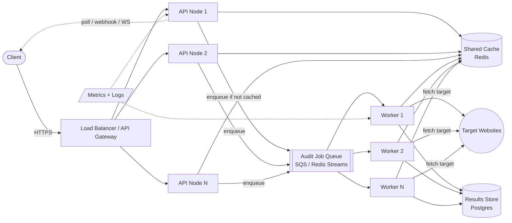

# Page Pulse at Scale — Architecture, Trade-offs, Failure Modes, Observability
Digital Heroes SDE Task B — target load: 10,000 audits/day, bursts of 500 concurrent requests, customer-facing response-time SLA.

SLA target: p95 audit result available within 30 seconds of request, hard ceiling of 60 seconds before it counts as a breach.

---

## Assumptions

Assumptions: 10,000/day is treated as an average with bursts around business hours, not a flat rate — hence 500 concurrent being the real design driver. "Customer-facing SLA" is assumed to mean clients get a job ID back and poll or receive a webhook, not that they hold an open connection for 30+ seconds. This design assumes a small team operating the infrastructure, which is why Redis Streams is favored over SQS where possible — one fewer managed service.

---

## 1. Architecture

### 1.1 Why the single-process design from Task A doesn't survive this load

Task A's in-memory cache and in-process semaphore work for one instance. At 500 concurrent bursts they break in two ways: 
1. **Per-instance Cache:** Horizontal scaling multiplies redundant fetches to target websites instead of sharing hits.
2. **In-process Semaphore:** It only protects that single process. It does nothing to stop the fleet collectively overwhelming outbound network bandwidth or a single popular target domain.

### 1.2 Components

### 1.3 Data flow

1. **Client → API node** (behind a load balancer). API nodes are stateless — any node can serve any request.
2. **Cache check first.** API checks the shared cache (Redis) keyed by normalized URL. Cache hit → return immediately, no queueing.
3. **Cache miss → enqueue, don't fetch inline.** The API node does *not* call the target website itself. It pushes a job onto a queue (SQS, or Redis Streams for lower ops overhead at this scale) and returns a `202 Accepted` with a poll URL or job ID — the audit becomes asynchronous. This is the key change from Task A.
4. **Workers pull from the queue** at a rate they control, run the actual audit (fetch + parse), write the result into both the shared cache and a durable results store (Postgres), and the client polls `/api/audit/{jobId}` or is notified via webhook/WebSocket.
5. **Idempotency:** if two concurrent requests for the same uncached URL both enqueue, the queue consumer or a short-lived "in-flight" lock in Redis collapses them into a single worker execution — the second caller attaches to the first job instead of triggering a duplicate fetch.

### 1.4 Where state lives

- **Cache (Redis):** ephemeral, shared, TTL-based — same role as Task A's cache but shared across all nodes and workers.
- **Queue (SQS / Redis Streams):** durable buffer between "accepted" and "processed" — this is what absorbs the 500-concurrent bursts without the target-website-fetch layer having to absorb them directly.
- **Results store (Postgres):** durable audit history, needed for anything beyond "give me the latest result" (SLA reporting, trend analysis, dispute resolution).
- **API nodes:** stateless, so they scale horizontally behind the load balancer with no session affinity required.

### 1.5 Sizing check

If a worker takes ~2–3 seconds per audit and runs ~10 concurrently via its own limiter, one worker handles roughly 3–5 audits/second. Draining a 500-concurrent burst within the 30-second SLA window needs on the order of 15–25 workers active during the spike — a first-pass estimate to validate with load testing, not a guarantee, but it's what justifies autoscaling workers on queue depth rather than provisioning permanently for peak.

---

## 2. Technology decisions and rejected alternatives

| Decision | Chosen | Rejected alternative | Why |
|---|---|---|---|
| **Sync vs async API** | Async (enqueue + poll/webhook) | Keep it synchronous like Task A, just add more instances | A synchronous request holding an HTTP connection open for the full length of an audit (network fetch to an arbitrary, possibly slow, third-party site) doesn't scale under bursty concurrency — it ties a request-handling thread/connection to the slowest possible external dependency. Decoupling accept-the-request from do-the-work lets the API layer stay fast and lets the worker layer scale independently on its own bottleneck (outbound fetch capacity). |
| **Queue** | SQS (or Redis Streams if avoiding a second infra dependency) | Direct worker pool with no queue, just a shared in-process limiter across nodes via Redis (distributed semaphore) | A distributed semaphore prevents overload but doesn't buffer bursts — at 500 concurrent, requests over the limit would still need to be rejected or held somewhere. A queue *is* that buffer, with retry and dead-letter handling for free. |
| **Cache** | Redis | Keep per-node in-memory cache (Task A's approach), rely on load balancer sticky sessions to keep repeat requests for the same URL on the same node | Sticky sessions defeat horizontal scaling's main benefit (even load distribution) and create hot-node risk if one URL is unusually popular. A shared cache means any node/worker benefits from any other's cache write. |
| **Results persistence** | Postgres | Rely on cache TTL alone, no durable store | A 30-second SLA target implies customers may need to know what happened to a specific audit after the fact (support disputes, billing, trend reports) — TTL-expiring cache can't answer "what did we tell customer X at 14:02 yesterday." |
| **Worker fetch client** | Same `undici`-based fetch as Task A, pooled per target host | A generic HTTP client with no connection pooling per destination | Connection reuse to frequently-audited hosts materially reduces TLS handshake overhead at this volume. |

---

## 3. Most likely failure modes and mitigations

1. **A single popular target domain gets hammered by many simultaneous audit requests (thundering herd on one host), degrading that domain's own service or getting Page Pulse's IPs rate-limited/blocked by it.**
   *Mitigation:* per-target-host concurrency and rate limits inside the worker pool (not just per-client limits on the inbound API side), plus the in-flight-request dedup described in 1.3 so N simultaneous requests for the same URL become one actual fetch.

2. **Queue backlog grows faster than workers can drain it during a sustained burst, so audit latency silently blows past the 30-second SLA target.**
   *Mitigation:* autoscale worker count on queue depth (not CPU — CPU stays low while waiting on network I/O), set a queue-depth alert threshold well below the 30-second SLA breach point, and expose job age in the polling response so clients/dashboards see degradation before it becomes a hard failure. A dead-letter queue catches jobs that fail repeatedly (e.g., a target that always times out) so they don't block the queue.

3. **Redis (cache) becomes a single point of failure or a latency bottleneck under high read volume, and every request degrades together instead of independently.**
   *Mitigation:* run Redis in a managed HA configuration (primary + replicas, automatic failover), keep the cache non-authoritative (Postgres is the source of truth, cache is a read accelerator so a cache outage degrades performance, not correctness), and set a short client-side timeout on cache calls so a slow cache doesn't cascade into slow API responses — fall through to "treat as cache miss" rather than blocking.

---

## 4. Observability and rollback

### What to monitor / alert on

| Metric | Why it matters | Example alert threshold |
|---|---|---|
| **Queue depth / oldest job age** | Direct leading indicator of SLA risk before it's breached | Alert if oldest unprocessed job age > 15 seconds (50% of the 30-second SLA target) |
| **p50/p95/p99 end-to-end audit latency** | The actual SLA metric (enqueue → result available) | Page if p95 exceeds 30 seconds for 5 consecutive minutes |
| **Worker error rate by error code** | Distinguishes "our system is unhealthy" from "the internet is unhealthy" | Alert if `INTERNAL_ERROR` rate > 1%; timeouts/unreachable are expected background noise and get a much looser threshold |
| **Cache hit rate** | Drop indicates either a cache outage or a shift in traffic pattern (new URLs, TTL misconfigured) | Alert on sudden >30% relative drop |
| **Per-target-host request rate** | Early warning before Page Pulse gets blocked by a target site | Alert approaching the internal per-host cap |
| **API 5xx rate at the gateway** | Customer-facing failure signal | Page on sustained >1% |

### Rollback plan for a bad deploy

- **Immutable Versioned Rollouts:** Deploy API nodes and workers independently behind versioned, immutable images with a blue/green or canary rollout — new version takes a small percentage of traffic first (e.g., 5% of API nodes, or workers processing a low-priority queue partition).
- **Automated Rollback Triggers:** If the canary's error rate or p95 latency exceeds the baseline by a defined margin within the bake window, automatically shift traffic back to the previous version rather than waiting for a human to notice.
- **Decoupled API/Worker Deployments:** Workers roll back independently from API nodes — since they only communicate through the queue and cache (not direct RPC), a worker rollback doesn't require an API redeploy and vice versa, which shrinks blast radius and rollback time.
- **Instant Rollback Capability:** Keep the previous version's image immediately deployable (no rebuild needed) so rollback is a deployment-target swap, not a build-and-deploy cycle to prevent breaching the 30-second SLA.
